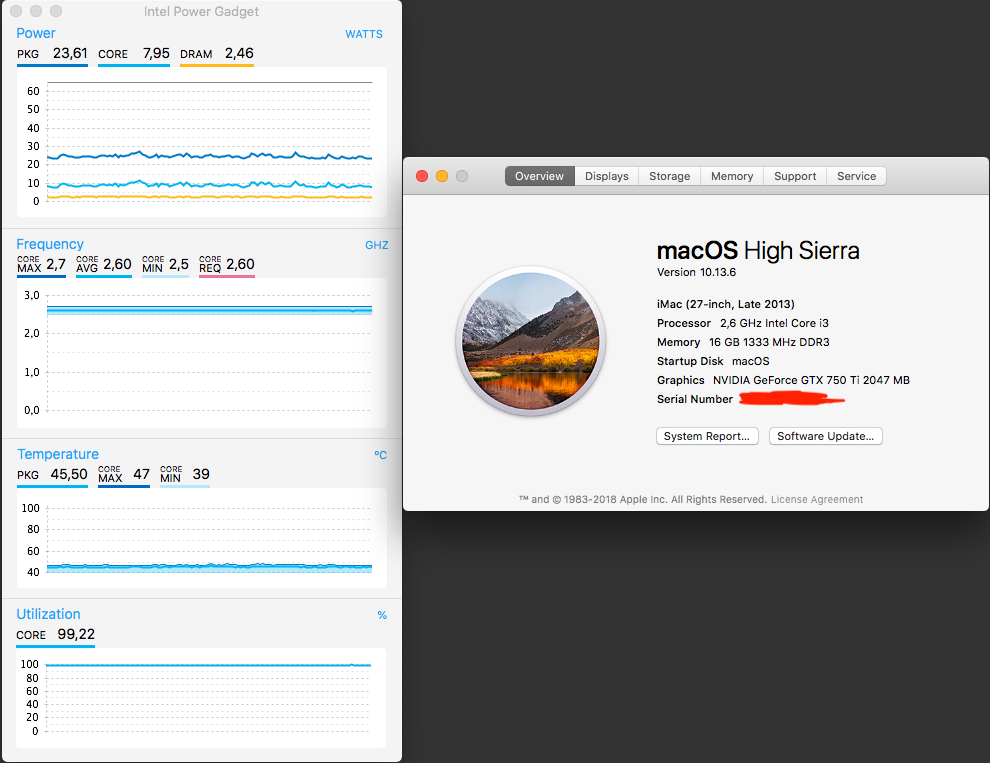

# EFI opencore with FakeCPU

This is an efi folder that i made to run my hackintosh using a confidential intel haswell(4th gen) i7. It is working with High Sierra, Mojave and Catalina. I didn't check compability with catalina and other versions, but i think it won't work with big sur.

  
  

## Getting Started

First make sure if you can install your macOS without any patch, try differents EFI folders (i recommend searching in Olarila, it is a great hackintosh forum with an amazing amount of content and EFI folders) before using mine, maybe you don't need these patches.
I used some kernel patches and a fakeCPU ID to successfully boot.

### Prerequisites

Unsupported intel CPUs like Ivy Bridge, server CPUs some xeon and high-end processors like Haswell-E.
Remember that nvidia gpu's are only supported on macOS 10.13.x. Mojave, Catalina and Big Sur you won't be able to use your gpu.

### Installing

Just paste my EFI folder in your EFI partition. Please check the config.plist and kext folders before booting, this EFI folder are injecting nvidia web drivers and Realtek8111g network controller

#### Changing network driver

If you want to change or disable the network driver, download the right kext to your controller, put inside "kexts" folder and edit "config.plist": 
    
     If you have an mac, hackintosh or virtual machine, you can edit it using Open Core Configurator (OCC):

        
         Open config.plist on OCC then go to Kernel tab, disable "RealtekRTL8111.kext" and inject your network controller's kext:

        

        
        

     
     If you're using windows or linux:
 
        
         Open "config.plist" with any text editor, search and remove the selected lines to disable. If you're changing your network driver, just replace "RealtekRTL8111" from green highlighted lines with your kext's name

        

        
        

#### Disabling NVIDIA driver
If you have an AMD or HD Graphics GPU and want disable the NVIDIA GPU driver, edit "config.plist":  
    
     If you're using mac, hackintosh or virtual machine, you can edit it using Open Core Configurator (OCC):
  
    
         Open config.plist on OCC then go to NVRAM tab, enter the second UUID and remove "nvda_drv" key:
        

        
        
 
    
     If you're using windows or linux: 

    
         Open "config.plist" with any text editor, search and remove the selected lines to disable:
 
        

        
        

## Running the tests

That's it, now (hopefully) you can enjoy your hackintosh with your confidential or unsupported CPU! Cheers

*Unfortunately it's showing as i3, but it is an i7 with 4 cores and 8 threads running great, also tested iGPU with metal on premiere pro export and it's fine

## THANKS!

Especial thanks and credits to dortania's openCore (github.com/dortania/OpenCore-Desktop-Guide) and Olarila (olarila.com)
